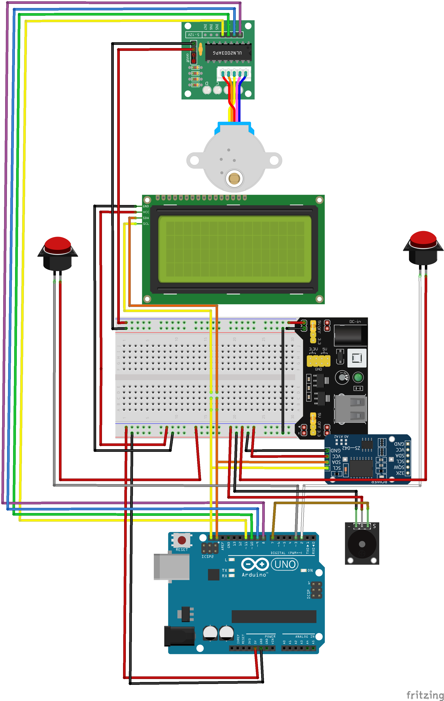
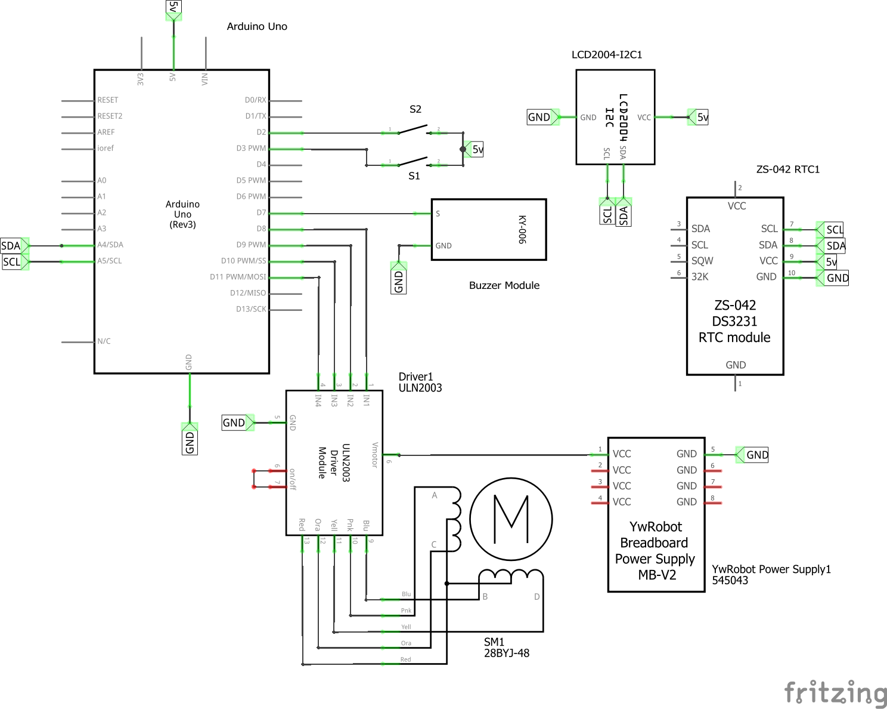

# Pill-Dispenser
An automatic pill dispenser for Arduino
## Features
* Real Time Clock with adjustable time
* Dispense hours stored in EEPROM to avoid loss after Arduino power lost
* Intuitive user interface for configuration using only buttons and an LCD Display
* Up to 6 dispense hours per day
* Buzzer for alerting the user
## Arduino Libraries
* LiquidCrystal I2C by Marco Schwartz v1.1.2
* RTClib by Adafruit v2.1.1
* Stepper by Arduino v 1.1.3
* Wire by Arduino
* EEPROM by Arduino
## Components
* Arduino Uno r3
* Display LCD 2004 + i2c Module
* Stepper motor 28byj-48 5v + Driver uln2003
* RTC module ds3231
* Passive buzzer module mh-fmd
* MB102 Breadboard Power Supply Module 3.3V 5V
* Power Supply 12v 2A

## Schematics
### Breadboard

### Circuit Diagram

## Prototype
### Images

### Demonstration

https://user-images.githubusercontent.com/20825228/185848761-0e6dda60-1d55-438b-9132-2dad3d6754b3.mp4

https://user-images.githubusercontent.com/20825228/185848781-a2c4229f-09a3-4b9a-b581-a91163f0bdb1.mp4

